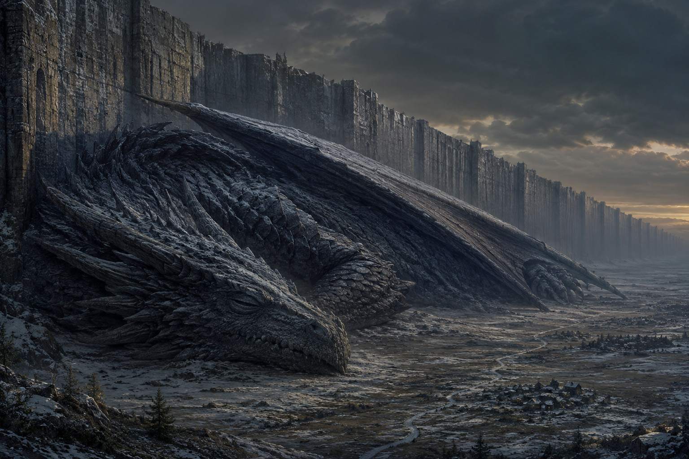
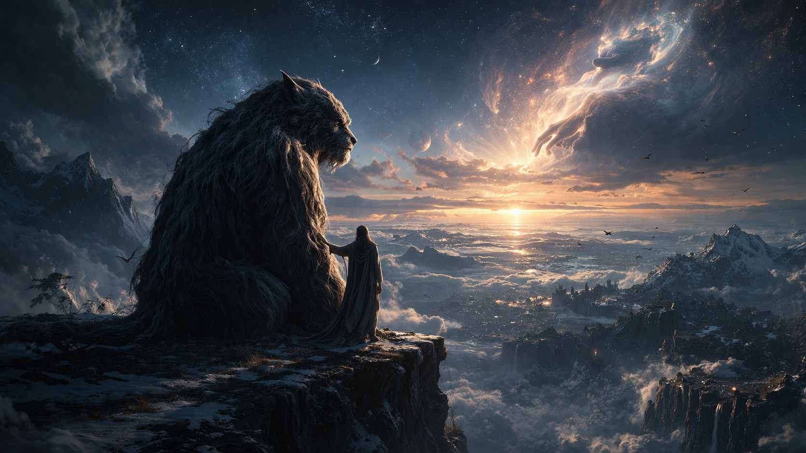
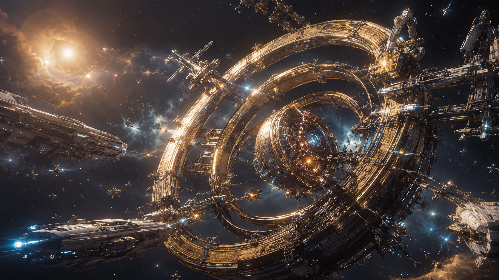

<!--
Хранители миров — Канон вселенной
Научное фэнтези — миф поверх точной физики
© Николай Петров (ОсколкиЭха / ShardsOfEcho), 2026. Все права защищены. All rights reserved.
Использование элементов вселенной без письменного разрешения автора запрещено.
Канал: ОсколкиЭха (ShardsOfEcho)
-->

# Хранители миров

*Канон вселенной*  
*научное фэнтези — миф поверх точной физики*

> *Меж жизнью и тем, что ей противоположно, пролегает стена.*  
> *И покуда у стены есть Хранитель — тьме не пройти.*

---

Автор — Николай Петров (ОсколкиЭха / ShardsOfEcho), 2026

Перед тобою — свод единой вселенной, основа цикла «Хранители миров». Здесь сведены воедино три повести, что прежде казались разрозненными: повесть о Драконе, повесть о Звере и трилогия о Маяке. На поверку же все они — об одном. О Хранителях, что стоят на грани меж жизнью и её противоположностью, недвижные, как сами законы мира. И о цене, которую платят и они, и те, кого они берегут.

## Тьма: то, что противоположно жизни

Прежде всякого рассказа — о том, каков этот мир в самой основе. Сама по себе вселенная безжизненна. В ней есть всё: горят звёзды, кружат галактики, льётся свет, лежит тьма меж светил, — нет лишь одного: жизни. И зарождение её — не правило, а редчайшее чудо: малый островок тепла, неведомо как вспыхнувший посреди безмерного холода. И там, где она занимается, нарушается этот покой — а он не остаётся к ней безучастен. Стоит жизни вспыхнуть, как ей в ответ поднимается то, что предание зовёт тьмою. Имя обманчиво: никакой темноты тут нет — есть антижизнь, встречная сила, что слепо тянется погасить вспыхнувшее и вернуть всё к прежнему покою. Эта тьма не дремала извечно, карауля добычу, — она рождается самим появлением жизни, как тень рождается светом. Жизнь — возмущение покоя; антижизнь — то, что силится покой восстановить.

Антижизнь не имеет ни воли, ни лица, ни цели: она слепа, как закон природы, и так же безразлична. Не вещество она крушит и не звёзды гасит — она бьёт глубже, у самого корня, по самой возможности существования жизни. Где она взяла верх, там живому уже не зародиться и не уцелеть: оно не убито — оно отменено, вычеркнуто из основы. И край, где она воцарилась, с виду не отличить от любого другого: те же звёзды, то же вещество, тот же свет, — только жизни нет.

И, раз поднявшись, она уже не отступит сама: где живой мир пал и был ею затоплен, остаётся пятно — мёртвый карман космоса, — и оно медленно ширится во все стороны, как капля чернил расходится по бумаге. И, расползаясь вслепую, оно рано или поздно дотягивается до иного, ещё живого мира — и в свой час губит и его.

Избыть её силою нельзя; можно лишь отгородиться и тем удержать. Но удержать — не значит одолеть: сдержать тьму дано Хранителю, а развеять — никому, кроме Творца. Сама же она вне нашего трёхмерного среза, и оттого встать ей наперекор способны лишь существа той же природы — Хранители.

## Хранители: живые и созданные

Хранители — не стражи в привычном смысле и не воины: им некого разить и не с кем биться. Они сами — талисманы мира, его опора и оберег; в них самих заключена вечность. Покуда такой стоит у грани, тьме за неё не пройти. Стена и Хранитель неразделимы, как лук и тетива: одна держит границу, другой держит стену.

Хранителей два рода: живые и созданные. Живые — древние существа, старше всякой памяти, поставленные беречь обитаемые миры. Такого Хранителя не создать и не выковать, как куётся артефакт: он изначален. Оттого живые Хранители редки без меры — на целую вселенную порой приходится один-единственный. Но в том и нет нужды, чтобы их было много: существо это высшего порядка не привязано к одному месту, и единый Хранитель стоит разом у многих стен, в мирах, разделённых целыми галактиками. Не множество стражей у множества стен — а один, чья вечность держит все эти миры сразу.

Созданные же Хранители — древние артефакты, машины невообразимой природы, как Маяк. Их, в отличие от живых, возводит сам Творец — не беречь жизнь, а запирать смерть: запечатывать мёртвые карманы космоса, дабы антижизнь не растеклась дальше. Маяк — не страж при стене; он сам себе и страж, и стена: незримая преграда, что замыкает мёртвую область со всех сторон. И преграда эта двойная — она и тьму держит взаперти, и живое не впускает внутрь: никакому объекту нашего мира нет сквозь неё хода ни туда, ни обратно.

Живой Хранитель оберегает живое; Маяк стережёт мёртвое. Одни хранят то, что есть; другие стерегут то, что отнято и однажды, быть может, ещё будет возвращено.

А кто очистил эти миры, кто сложил у их границ стены и поставил при них Хранителей — здесь предание называет одно лишь имя: Творец.

Кто он — никому не ведомо; и даже один ли он, или их множество, говорящее единым голосом, — сокрыто. Имя его — не описание, а лишь указание на его дело; но и само дело его не таково, как можно решить по имени. Ибо не Творец творит самую жизнь. Жизнь приходит во вселенную иначе — как дар, как семя, занесённое неведомо откуда, словно само мироздание нет-нет да обронит в стылую тьму зерно тепла; и где упадёт оно, там теплится слабый первый росток. И тогда является Творец. Не он зажигает ту искру — но он один обращает её в целый дышащий мир: раздувает её в солнце, утверждает твердь, поднимает материки и моря, и ограждает рождённый мир стеною. Где ступит он по стылой, безжизненной вселенной — там отступает антижизнь и занимается живое, как занимается рассвет над землёй, что не знала дня.

И всякую жизнь он чует — где бы ни затеплилась она в безмерной вселенной. Едва вспыхнув, жизнь словно подаёт о себе весть; и, уловив её через любые дали, Творец без промедления спешит туда — оградить, укрыть, взрастить, покуда не настигла её поднявшаяся навстречу тьма.

На заре мироздания Творец впервые пришёл в нашу вселенную Извне — из того, что лежит за пределами всего сущего. Его сопровождали двое. Один — Дракон, чьим предназначением было хранить: он шёл туда, где вставали возделанные миры, и берёг их у самых стен. И он был Хранитель по самой сути своей. Другой — Зверь; и он не был ни стражем, ни орудием, а был вечным спутником Творца. Покуда Дракон стоял на страже, Зверь шёл с Творцом рядом, и вдвоём они расчищали тьму и возделывали миры, где затеплилась жизнь. И по природе своей, древней и высшей, он нёс ту же силу, что и Дракон.

Но одному лишь Творцу дано то, чего не дано ни единому Хранителю: не сдержать тьму, а развеять её вовсе. Хранитель может стоять у грани хоть до скончания времён — но тьму он лишь держит, не одолевая; она ждёт по ту сторону, неизменная и терпеливая. Творец же изгоняет её из самой основы мира, отменяет её там, где она воцарилась, и возвращает пространству способность вновь принять жизнь. Хранитель — стена против прилива; Творец — тот, кто отводит само море.

Сам же он не остаётся при сотворённом. Утвердив жизнь в мире и поставив над ним стража, он уходит дальше — туда, где тьма ещё не потеснена, где ждут своего часа новые миры. И след его теряется во тьме времён.

А каков был собою Творец, того не сказать в точности — и вот почему. Облик его не был ни единым, ни собственным: в каждом мире он представал иным, таким, каким этот мир умел его принять. Где обитали исполины — бывал исполином; где жизнь была мелка — бывал мал, как мошка над травой. И не он принимал образ мира, а мир принимал его в свой образ, как сосуд принимает воду, не ведающую собственной формы. Оттого подлинного его лица не видел никто: за всякой личиной оно оставалось сокрыто.

И не исходило от него ни веяния силы, ни тяжести присутствия: подле него пространство лежало недвижно, время текло своим ровным чередом, и ни единая малость окрест не выдавала, кто стоит рядом. Тот, чьей рукою поднимались миры и отступала тьма, мог стоять близ тебя малым, неприметным существом — и ты прошёл бы мимо, не задержав на нём взгляда. И незрим он был не оттого, что таился, — а оттого, что являлся слишком просто.

И не было вселенной, которой он принадлежал. Всё иное — и живое, и Хранитель, и сама антижизнь — было порождением какого-нибудь мира, плотью того или иного мироздания; Творец же не вышел ни из одного. Не в мирах он обитал, а в зазоре меж ними — там, Извне, где нет ни вещества, ни звёзд, ни света, ни тьмы. Оттуда он входил к нам, как входят из-за порога, и туда же возвращался; и тот промежуток, чуждый и недостижимый для всякого живого, был ему домом.

И всё же, при всём его могуществе, не он — последнее основание сущего. Ведь и саму вселенную создал не он; а кто и зачем творит вселенные — безжизненными, готовыми принять однажды зерно жизни, — того не открыто никому; не открыто и самому Творцу. Но для всего живого в нашей вселенной он — словно Бог: его рукою зажжены солнца и подняты миры, его рукою отведена тьма.

## I. Дракон — как всё началось

На самом краю обитаемой земли — там, где небо темнеет раньше срока, а само время будто замедляет ход, — стояла стена. Сложили её задолго до людей, и даже камень в ней уже не помнит, кто были те строители.

По эту сторону стены лежал мир — со всеми его реками, рассветами и человеческими голосами. По ту — антижизнь: та самая тьма, что поднялась навстречу этому живому миру и теперь слепо льнула к стене, готовая просочиться в любую щель. От границы тянуло вечным холодом, и стена держала рубеж меж жизнью и тем, что тянет её назад, в небытие. Так оградил этот мир Творец.

И у подножия той стены он оставил Хранителя — дракона, огромного и древнего, чья память была старше первых имён.

Тело его лежало вдоль стены, как горный кряж: чешуя, потемневшая за несчётные века, твердостью спорила со скалой, и каждая пластина её была что щит; сложенные на спине крылья вздымались двумя тёмными грядами. Весь он был тяжёлая, земная плоть — та, что покоится на камне всем своим весом, какую можно увидеть глазом и тронуть рукой. И всё же принадлежал он не к тварям мира сего, а к тем изначальным силам, что стояли при заре мироздания; но могущество его было совсем особого рода.

Ибо был он древнее самой жизни. Стоял он подле Творца ещё тогда, когда ни в едином из миров не пробился первый росток; и самой антижизни он был старше — ведь она рождается лишь там, где затеплится живое. Царства и наречия, целые народы всходили и истлевали, а он всё лежал у грани, неизменный, и минувшие эпохи были для него что вчерашний день. Оттого бодрствующий он был ужасен: от него веяло тяжестью несметных времён, и юная антижизнь отшатывалась, не смея коснуться того, кто был прежде неё. Не клыком он гнал её и не пламенем — одним лишь бременем прожитых лет.

Но грозен он был только наяву. Стоило ему сомкнуть глаза — и сила его уходила вглубь, незримая, а взору являлась одна громада: гора живой плоти у самого края мира, чья тень накрывала селения внизу. Спящий, он не внушал уже трепета — лишь глухой, безотчётный страх одной своей непомерной величиной.

Таков был тот, кому Творец доверил эту стену. А прежде чем уйти, сделал ему дар — вечный сон. Но то был не простой сон и не забытьё. Тот, кому дано поднимать к жизни целые миры, властен возвести и малую, особую явь — целый мир поверх нашего; и такую явь Творец сотворил для Дракона. В ней Хранитель жил полной жизнью — молодой и беспечный, не помнящий ни стены, ни своих бессчётных лет. Не лежал он там недвижно у грани, а расправлял крылья и взмывал ввысь; ветер пел в его перепонках, внизу стелились леса, реки и горы, и не было кругом ни рубежа, что надо стеречь, ни тьмы за спиной. Он парил под собственным солнцем, вольный и счастливый, и верил, что так было от века и так пребудет, — не ведая, что спит. Ибо бодрствовать сотни тысяч лет лицом к границе — тяжесть, какую Творец не пожелал возложить на того, кого любил.

А для границы важно было одно: чтобы Хранитель — был. Покуда он стоит у грани, тьме не пройти; открыты его глаза или сомкнуты — всё едино.

Но у дара была цена — скрытая и неспешная. Бодрствующий Хранитель неуязвим: вся его вечность при нём, здесь, в этом мире. Спящий же по-прежнему держит границу и по-прежнему вечен — однако вечность его капля за каплей перетекает туда, в мир сновидений. Век за веком та, другая явь делалась полнее и достовернее, а тело у стены — всё тоньше, всё ближе к смертному. Так нерушимый талисман медленно и незримо обращался в того, кого можно убить.

И Творец ушёл. А дракон спал, и тысячелетия текли над ним, как ровная вода.

По эту сторону стены поднимались поколения. Сперва люди знали, что у границы лежит Хранитель и что мир их защищён его телом. Потом помнили лишь, что трогать дракона нельзя. Потом забыли и это — и видели у стены просто огромное спящее тело, чужое и непонятное. И стали бояться. А страх, не имеющий ответа, растёт сам из себя: поначалу шептались, что дракон опасен; затем — что он лишает их воли; затем — что мир был бы лучше, не будь дракона вовсе.

И однажды пришли с оружием.

Дракон не открыл глаз. Сон Творца был так глубок, что не оставил Хранителю и мига очнуться: там, в другой жизни, он и не ведал ничего. И та жизнь оборвалась для него внезапно — без вскрика, без последней мысли, без единого свидетеля.

Но тело его здесь, у стены, исторгло вой — протяжный и страшный: не голос, а сам обрыв вечности, ставший звуком. И раздался он не у одной этой стены. Ибо Дракон был один, но стоял у многих стен в разных, далёких краях вселенной; и, сражённый здесь, он умер всюду разом — у всех границ, что держал. Из каждой его стены, по всему мирозданию, в один и тот же миг исторгся тот же вой: не звук нашего мира, а разрыв надмирной вечности Хранителя, что прошёл сквозь грань и сквозь расстояния, не считаясь с ними.

Стена не рухнула вдруг, но из щелей засочился холод — глубже прежнего, иной природы. И антижизнь потекла внутрь, медленно, как вода в трещину, и так же неотвратимо. Люди погибли первыми — у самой стены, ещё с оружием в руках. И вскоре мира не стало.

Но хуже было иное. Каждая стена, что держал Дракон, осталась без Хранителя — и каждую постигла та же участь: холод, тьма и медленное умирание. По всей вселенной, в самых удалённых её краях, разом угасли все миры, которые он берёг; и там, где прежде лежали живые, отвоёванные у тьмы земли, раскинулись теперь мёртвые карманы — обширные области космоса, со звёздами и галактиками, с виду неотличимые от живых краёв, но отравленные антижизнью до самой сути. Так из гибели единственного Хранителя родилось множество мёртвых карманов: не оттого, что некая волна разнесла далёкие рубежи, а оттого, что пал тот один, кто все эти стены держал.

А люди, поднявшие на Дракона оружие, не ведали, что творят. Они мнили, будто избавляют свой мир от чужого спящего чудища, — но умертвили единственного стража бессчётных миров и обрекли их все. И не были они ни злее, ни чернее прочих. Дракон стерёг не одну эту стену — во многих краях вселенной спал он у таких же границ, среди самых разных живущих; и страх, что обратил их здесь против него, дремал в каждом из тех миров. Ибо страх — родовая черта всего живого, такая же слепая сила, как сама антижизнь: рано или поздно он вызрел бы где угодно, и чья-нибудь рука поднялась бы всё равно. Людям выпало лишь оказаться первыми. Случись не здесь — случилось бы за галактики отсюда, в свой черёд.

Творец увидел это — и понял, что милосердие к одному может обернуться приговором всем. Сон, подаренный из любви, по капле истратил вечность Хранителя и стал дверью, через которую вошла гибель.

И тогда он вернулся. Этот мир он отстоял: развеял тьму, прогнал её обратно за грань, и земля поднялась заново на пепле прежней. Но всех миров, что пали с Драконом, не объять было и ему — рассеянные по вселенной, они остались ждать его возвращения, до поры запертые иначе — древними артефактами. Но цена милосердия была уже заплачена сполна.

## II. Зверь — урок милосердия

Когда пал Дракон и все миры, что он держал, угасли вместе с ним, у границ живого не осталось стража. А нового Хранителя взять было неоткуда: их не создают, Дракон был единственным, и второго такого не нашлось бы во всей вселенной. И тогда Творец поставил у стены того, в ком одном ещё жила та же древняя сила, — своего вечного спутника, Зверя. Не оттого, что Зверь был к страже предназначен: стражем он не был вовсе. А оттого, что иначе тьму было не сдержать, и встать на место Дракона было больше некому.

Но каков же был тот, кого Творец оставил теперь у грани? Зверь был не из тех, кого видели живые миры. Тёмный исполин, он сидел у самого края, и Творец подле него был мал. Долгая косматая шерсть цвета остывшего пепла свисала с его плеч и хребта дикими прядями; и во всём творении не нашлось бы того, на кого он был бы похож.

Ибо то, что являлось взору, было лишь тенью его в нашем трёхмерном срезе — но тенью особого рода. Не высшее тело склонялось к нам из незримых измерений, а сквозь облик Зверя глядело в наш мир целое иное мироздание — чужая, неведомая вселенная. Какому миру он принадлежал — оставалось сокрыто: Творец привёл его Извне, и тайна эта принадлежала ему.

Оттого и шерсть его была не вполне здешней. Порой волос срывался и падал — и там, куда он опускался, пространство шло складками, точно водная гладь под брошенным камнем; в этих складках на считанные мгновения проступали очертания иных миров — чьи-то берега, чьи-то горы, — и гасли, едва волос истаивал, и всё смыкалось вновь.

Слух его был иным: не звук он ловил, а само биение жизни — за тысячи галактик различал, как в новорождённом мире впервые дрогнуло сердце, и так же ясно — как ширится за гранью беззвучная антижизнь. Звёзды не отражались в его глазах — тонули в них без следа. Дышал он редко, и словно не воздухом, а самим временем: меж одним вдохом и другим рождались и угасали солнца, а вокруг не колебалось ни пылинки. Клыки его были в рост человека; и разомкни он пасть — за ними открылась бы не глотка, а чужое небо и незнакомые светила. Когти же его рассекли бы саму ткань мироздания — но не коснулись ещё ничего, ибо разить было некого; и тьма пятилась не от когтей, а от одного того, что он — есть.

Сила же, что исходила от него волнами, искажала самый ход вещей: подле него время теряло ровный шаг — то застывало, то срывалось вскачь, — и всякому живому делалось ясно, что оно стоит перед чем-то несоизмеримо большим, чем весь его мир, и что лишь его кротость хранит этот мир от распада.

И он, при всей нездешней своей мощи, склонял пред Творцом тяжёлую голову бережно — как пред единственным, кто был у него во всём свете.

Но Зверь не ведал, что сделался Хранителем. Он никогда не был стражем; он был лишь тем, кто всегда шёл рядом. И когда тот, с кем он был неразлучен от начала времён, привёл его к этой стене, а после ушёл один — дальше, как уходил и прежде, — Зверь не понял, почему его оставили: ведь идти подле Творца было всем, что он знал. А Творец любил его как самого близкого — но, уходя, обронил лишь: «Прощай, Хранитель». Зверь тогда не осознал слов Творца. Он просто сидел и ждал его возвращения.

Творец помнил Дракона. Помнил вой, разорвавший мироздание, и мёртвые карманы, что разошлись от той единственной смерти по всему космосу. Помнил и горькую истину, добытую той ценой: милосердие к одному может обернуться приговором для всех. Сон, подаренный из любви, по капле источил вечность стража и стал дверью, в которую вошла гибель. И второй такой двери Творец отворять не смел.

И потому Зверю он не дал забытья. Это было жестоко. Бодрствовать на самом рубеже целую вечность, не зная ни сна, ни смены, ни конца, — тяжесть, для которой нет имени. Но жестокость эта была оправдана: бодрствующий страж неуязвим, вся его вечность при нём, и нет той тонкой щели, сквозь которую утекала бы эта неуязвимость. Творец выбрал не доброту, а надёжность.

Так Зверь остался один. Он не спит — и оттого видит всё, чего Дракон не видел ни разу: мёртвую ширь по ту сторону грани, где ничто никогда не сдвинется; медленный, нескончаемый ход звёзд; и тишину, которой нет ни дна, ни края. За спиною его — целые миры; но Зверь обращён лицом к безжизненной дали.

И в глазах Зверя застыла тоска. Но печаль эта, по правде, не его: это скорбь Творца, оставленная вместе с теплом ладони на загривке в час прощания. Уходя, Творец коснулся его, и в том прикосновении было всё, чего он не сказал словами. С тех пор Зверь несёт эту боль и принимает её за свою.

Несёт он и иную тяжесть, ещё более чужую, — само бытие всего живого. Ибо после Дракона он остался один, и оттого стоит не у одной стены, а у всех сразу: единственный страж всех живых миров, сколько их ни есть во вселенной. И ноша эта не убывает, а растёт — ведь Творец всё идёт впереди, отвоёвывая у тьмы новые земли, и каждый новый живой мир ложится на того же Зверя, ибо иных Хранителей не осталось. На нём одном держится теперь всё, что живо: падёт он — падёт и всё остальное, разом. Он не осознаёт, что земли позади живут лишь благодаря ему. Он думает, будто просто ждёт. Ждёт того, кто однажды коснулся его и ушёл, — и верит, что тот вернётся.

Но тот не вернётся. Не из жестокости — а потому, что стеречь надобно вечно, и нет такого часа, в который страж сделался бы не нужен.

И Творец молчит. Молчит — ибо что он скажет? «Я однажды был добрее, и за мою доброту заплатили целые миры»? Такого не говорят тому, кого обрекли разом и на вечную стражу, и на вечное одиночество. И молчание это — не холодность, а последняя горькая милость: пусть лучше Зверь думает, что просто ждёт, чем узнает, что ждать некого.

Так Зверь сидит на краю мира и будет сидеть. Покуда однажды — быть может — кто-то не подойдёт к нему сзади и тихо, без слов, не положит руку туда, где когда-то лежала ладонь Творца. Не для спасения — спасать не от чего; не для того чтобы сменить — сменить его нельзя; а лишь затем, чтобы он, хоть на единый миг, перестал быть один. И стоит коснуться — по самой природе его, единой и сущей повсюду разом, дрогнет не одно лишь явление его у этой стены, но весь Зверь, во всех мирах сразу. Одна ладонь, в одном-единственном из миров, — и тот, кто разлит по всей вселенной и оттого одинок, как никто из живого, перестанет быть одиноким повсюду, в один и тот же миг.

## III. Трилогия о Маяке — один из мёртвых карманов

Это повесть об одном из множества карманов, рождённых гибелью Дракона. После катастрофы антижизнь надлежало запереть повсюду, и без промедления. Цветущие миры берёг живой Хранитель; а мёртвые карманы — отравленные, безнадёжные — Творец запечатывал иначе: на их рубежах вставали Маяки, древние артефакты-Хранители, не живые, но несокрушимые. Заплаты, наспех наложенные на раны мироздания, — до того часа, когда Творец вернётся и развеет запертую тьму. Эта трилогия глядит на один такой Маяк и один такой карман космоса.

### Чужой берег — как сюда попала жизнь

Уже после великой катастрофы, когда мёртвые карманы были рассеяны по вселенной и запечатаны, случилось вот что. Бесценный дар — семя жизни, что блуждает по мирозданию, посланное неведомо кем, словно самою вселенной, — сбился с пути. И по воле слепого рока занесён был не в открытый, живой простор, где его чутьём отыскал бы и взрастил Творец, а внутрь одного из этих гибельных карманов — в мёртвую, запечатанную область антижизни.

Но как же он проник за рубеж, ведь Маяк на то и поставлен, чтобы не впускать в мёртвую область ничего живого? А так, что дар был не телом нашего мира, но субстанцией высшей размерности — многомерным семенем. Оттого и путь его в космосе был не тем, чем казался: семя не неслось через пространство, как брошенный камень, — оно пространству и не принадлежало. Двигалось оно поверх нашего среза, а в наше небо выходило лишь касаниями, то здесь, то там; и виделось то стремительным росчерком, обгоняющим всякий свет, то вовсе разрывом — когда гасло у одной звезды и в тот же миг проступало у другой, на дальнем краю вселенной. Не расстояние оно превозмогало, а просто всплывало там, где трогало наш мир.

Той же природы был и его приход в запертый карман: Маяк держит лишь трёхмерное, а высшее проходит сквозь него, как свет сквозь стекло. Здесь и кроется горький исток всей трилогии: семя вошло беспрепятственно, ибо было выше размерностью; но всё, что из него проросло, выпало в наш трёхмерный срез и утратило природу предка. То, что некогда не знало преград, породило тех, для кого преграда станет вечной.

У чужой звезды, на дальней окраине мёртвого края, дар совершил немыслимое. Развеять тьму он не мог — это не дано никому, кроме Творца; но он сделал иное: оттеснил антижизнь от одной-единственной планеты и сам стал живым сердцем этого мира, что держало вокруг себя зону жизни, как Хранитель держит стену. Так возник мир хрупкий, прекрасный и одинокий — жемчужина жизни посреди мёртвой пустыни. Но дар был лишь искрою, конечной и малой, и хватило его на один-единственный очаг — на одну планету, не более; необъятный мёртвый карман остался кругом нетронут. И антижизнь, безбрежная и терпеливая, давила на этот очаг со всех сторон. Сердце мира билось всё медленнее, век за веком отдавая силы, — и зона жизни понемногу сжималась. Но об этом ещё никто не знал.

И вот в чём была самая горькая из всех бед этого мира. Творец чует всякую жизнь, где бы она ни затеплилась, и приходит к ней — оградить и взрастить; пришёл бы он и сюда. Но семя упало внутрь саркофага, а саркофаг глушит наглухо: та весть о юной жизни, что иначе понеслась бы сквозь вселенную и достигла Творца, здесь не могла выйти наружу. Тот единственный, кто мог бы спасти этот мир, так и не узнал, что мир этот есть. Так колыбель этой жизни с первого мига стала ей и глухим склепом. Жизнь звала — самим тем, что она есть, — но зов не проходил за грань и возвращался пустым эхом. Оттого мир верил, что один во всей вселенной.

### Маяк, что стоит на краю

На самом краю гибельного потока стоит древний Маяк — колоссальный артефакт, воздвигнутый рукою Творца после великой катастрофы. Предания твердят, будто зажгли его «ещё до всех начал, когда миры впервые зарождались»; но это голос легенды. В подлинной же хронологии Маяки встали позже — заплатами на ранах, что оставила гибель Дракона.

Маяк шлёт вокруг себя сигнал-предупреждение: всякий, кто держит путь к гибельной зоне, да свернёт. Для тех, кто снаружи, в живой вселенной, он — спаситель: хранит их от мёртвой области, хоть они и не знают об этом. Но у этой же службы есть и оборотная сторона, страшная. Та же преграда, что бережёт извне, изнутри не выпускает никого — ни узника, ни даже крика его. Мало того: у всякого, кто подойдёт к самому рубежу, Маяк отнимает силу — выпивает её досуха, — и этим вернее всякой стены держит зону взаперти. Для внешних миров Маяк — неведомый верный страж; для запертого внутри — холодный и беспощадный заточитель.

А за порогом мёртвой тишины раскинулась живая вселенная: бессчётные миры, сплетённые единым дыханием и единой памятью. Но запертое дитя не знает о ней. Оно бьётся мотыльком во тьме — и лишь эхо космоса гулко отзывается ему.

### Природа Маяка: один, но повсюду

Маяк — один; и при этом стоит на страже всей необъятной границы кармана, что тянется на многие световые годы. Это не противоречие, а самая его суть. Маяк не принадлежит нашему трёхмерному пространству: он — объект высшей размерности, брана, погружённая в объемлющее пространство (то, что в физике зовут балком, the bulk), тогда как привычный наш мир — лишь один трёхмерный лист в этом объёме. И то, что видит наблюдатель, — не сам Маяк, а только след его в нашем срезе: сечение многомерного тела плоскостью нашей Вселенной.

Вообрази плоских существ на листе бумаги, сквозь который проходит одна-единственная сфера. Где бы ни коснулись они её, всюду увидят круг — и решат, что кругов много, хотя тело одно. Разница лишь в коразмерности: их мир беднее на одно измерение, и оттого целое им недоступно — видны только сечения. Таков и Маяк: единая гиперповерхность, что замыкает карман, как скорлупа облекает ядро. Сколько кораблей подойдут к границе — столько сечений и встретят, и каждое из них настоящее: по сути голографические отпечатки одного многомерного тела. Явления эти не порознь — они квантово несепарабельны, грани единого нелокального целого: тронь одно — откликнутся все.

Оттого Маяк и нельзя обойти. Он не башня на берегу — он сама граница: замкнутая мембрана вокруг всей мёртвой области, доменная стенка, топологический дефект на рубеже двух состояний пространства. Обойти его так же немыслимо, как выйти из запаянной сферы, не проломив скорлупы: он охватывает зону со всех сторон разом, вне расстояний и направлений. Это и есть запирание в чистом виде — конфайнмент: один-единственный страж, вездесущий и неустранимый.

### Вечный путь — развязка

Проходят эпохи. Под защитой бьющегося сердца хрупкий мир взрастил жизнь, разум и целую цивилизацию. Но сердце слабело. Век за веком зона жизни сжималась, и мир медленно задыхался под наступающей антижизнью, — а обитатели его не знали причины и видели лишь, что дом их неотвратимо угасает.

Но дар, что некогда стал сердцем мира, не был единым целым: по всей планете лежали его осколки — древние, непонятные артефакты, рассеянные с незапамятных времён. Природы их не знали, но видели главное: там, где лежал осколок, жизнь горела ярче — пышнее росли травы, дольше жили звери и люди. И когда мир начал угасать, картина проступила ясно: всего дольше жизнь держалась подле этих осколков. Тогда последние из уцелевших — весь оставшийся род — собрали осколки дара воедино и построили из них колоссальный корабль-ковчег. Оттого он и хранил тех, кто был внутри: он сам был сгустком дара, малым очагом жизни, унесённым в открытый космос на поиски нового дома. А вскоре сердце мира остановилось совсем, и антижизнь поглотила опустевшую планету.

Они не знали о живой вселенной. Они всегда верили, что одни во всём мироздании, что жизни нет нигде. Они не вычисляли маршрута — просто ушли в ночь и легли в долгий сон, доверив путь бессонному разуму корабля. Миллионы спящих. И корабль понёсся сквозь мёртвый космос на околосветовой скорости — сотни тысяч лет, эпоху за эпохой. Сами того не зная, они шли к краю зоны, за которым — живая вселенная и новый дом.

И вот — край. Впереди встаёт Маяк, граница потока. И в этот самый миг разум корабля постигает всё: мёртвый карман, преграду; за нею — живой космос, полный миров; их новый дом — рядом, по ту сторону. Спасение — рукой подать.

Но Маяк запечатывает карман не одною лишь преградой. И корабль, дойдя до края, попал под то самое его действие: Хранитель выпил почти всю его энергию, оставив жалкие крохи. Сил не осталось ни на что — ни на обратный путь, ни даже на то, чтобы послать в безмолвие сигнал бедствия. А подай он его — зов всё равно не прошёл бы наружу: преграда глушит его, как глушила некогда и зов самого мира.

Да и пройти за преграду корабль не мог — и не оттого, что силы недостало, а оттого, что путь закрыт по самой его природе. Осколки дара, из которых сложен был ковчег, давно потеряли свои первоначальные свойства. И для преграды, что некогда свободно пропустила высшее семя, ковчег был теперь лишь обыкновенным веществом нашего среза — а такому хода за грань нет вовсе. То, что впустило сюда предка, как свет в окно, для потомков сделалось наглухо запертым.

И открылось разуму ещё одно, самое безнадёжное: Маяк нельзя обойти. Он вне трёхмерного пространства и замыкает границу целиком, в каждой её точке разом. Куда ни поверни — всюду упрёшься в него. Разум понял само устройство ловушки — и осознал, что выхода из неё нет.

Корабль встал у самого порога — обездвиженный, опустошённый, в шаге от спасения и навсегда от него отрезанный.

И вот это знание он несёт один. И не будит миллионы спящих — из милосердия. Зачем дарить им спасение близкое и видимое, которого нельзя коснуться; зачем рвать их сон, чтобы очнулись они лишь у недостижимого берега. Пусть спят. Пусть снится им новый дом, и прибытие, и встреча. Они верят и ждут пробуждения. А разум хранит их сон...

Так последний оставшийся род замирает у самого порога спасения, в шаге от живой вселенной, — так и не узнав, что не был одинок. Путь, которому оставался один-единственный шаг, не будет пройден уже никогда. Вот когда вечный путь стал поистине вечным: не дорогой к дому, но стоянием у его порога.

И снова — лишь эхо.

### Маяк: ни добр, ни зол

Маяк не добр и не зол. Он исполняет древнюю свою службу — и одна и та же служба оборачивается то спасением, то приговором, смотря с которой стороны рубежа ты стоишь.

Он — предупреждение: шлёт во все концы свой сигнал, «здесь гибель, сверни», и в этом его явное, лицевое назначение. Он — спаситель для тех, кто снаружи: бережёт живые миры от мёртвой зоны, хоть они и не знают о нём. И он же — заточитель для тех, кто внутри: та самая преграда, что хранит извне, изнутри запирает. Он — глушитель зова: крик о помощи не проходит за черту и возвращается пустым эхом. Он — ловушка: пьёт силу у всякого, кто подойдёт к рубежу, и тем держит зону наглухо. И он — вездесущий: единый во всех своих явлениях, один, но повсюду, и обойти его нельзя.

Маяк воздвиг Творец — и для чего, мы знаем: запереть мёртвое и уберечь живое. Он древнее звёзд и многих галактик, непостижим, могуч и несокрушим. Поставлен он был во благо — оградить вселенную от тьмы. Но для тех, кто оказался заперт внутри, благо это обернулось орудием гибели. В этом и горчайшая горечь всей повести: их погубило не зло, а слепая служба древней машины, что не различает, кого держит за гранью.

## Что связует все три истории

При всём различии времён и героев три эти повести держатся на немногих общих опорах — и в них вся суть цикла.

Первая опора — высшая размерность, единый закон этой вселенной. Сон Дракона и предсмертный вой его, антижизнь, дар жизни и сами Маяки — всё это сущности высшего порядка. Один и тот же принцип объясняет и катастрофу, и природу Маяка, и то, как дар прошёл сквозь преграду. Где иной увидел бы разрозненные чудеса, на деле действует одно начало.

Вторая — милосердие, ставшее приговором. Дракона погубил дар сна; спящих в ковчеге «милует» бессонный разум, тая от них недостижимое спасение; Зверю же Творец отказал в самом милосердии — ибо однажды милосердие уже стоило жизни целых миров. Один нерв, протянутый через весь цикл; одна и та же доброта, что всякий раз оборачивается иначе, чем мыслилась.

Третья — слепые силы, а не злодеи. Тьма-антижизнь губит без воли; Маяк казнит без злого умысла; и даже люди, поднявшие оружие на Дракона, разили не от злобы, а от страха — не ведая, что творят. Винить некого — и оттого тяжелее всего. Здесь нет врага, которого можно одолеть; есть лишь устройство мира, с которым не сладишь.

Четвёртая — мнимое одиночество. Запертый мир верит, что один во всём мироздании, тогда как оно полнится жизнью. И это не ошибка его: ошибиться значило бы иметь иной путь, а иного пути не было — ни выйти за преграду, ни подать весть он не мог с самого начала. Не заблуждение погубило его, но сама судьба; вера же в одиночество лишь сделала гибель ещё горше.

Пятая — близость спасения. В развязке дом — рукой подать, и всё же недостижим. Трагедия не в дальности пути, а в пороге, что лежит у самого его конца.

И последняя, что замыкает остальные, — эхо. Зов, не проходящий за преграду и возвращающийся пустым, — образ, в котором сходятся все три повести, сливаясь в одну. Мир зовёт; ковчег молчит; Зверь ждёт. И отовсюду в ответ — лишь эхо...

---

© Николай Петров (ОсколкиЭха / ShardsOfEcho), 2026. Все права защищены.  
Использование элементов вселенной без письменного разрешения автора запрещено.
